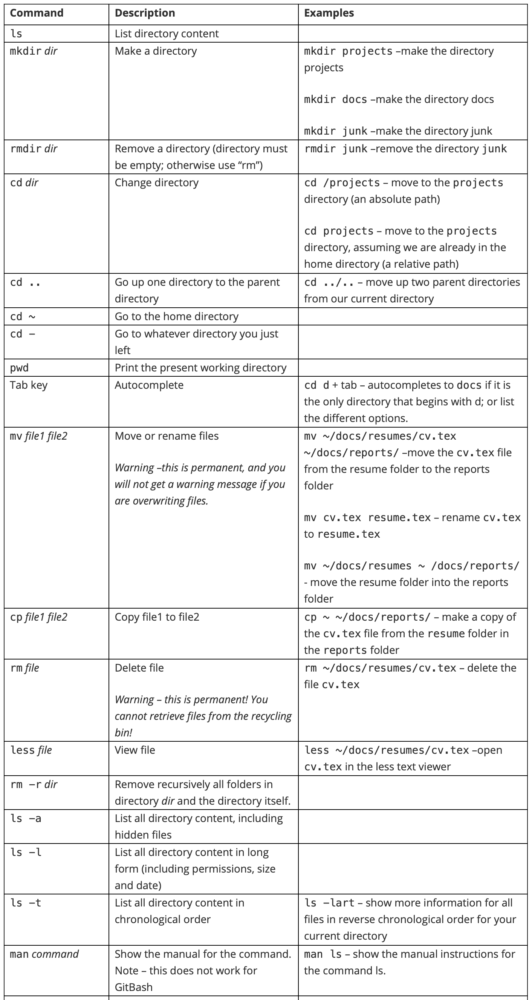
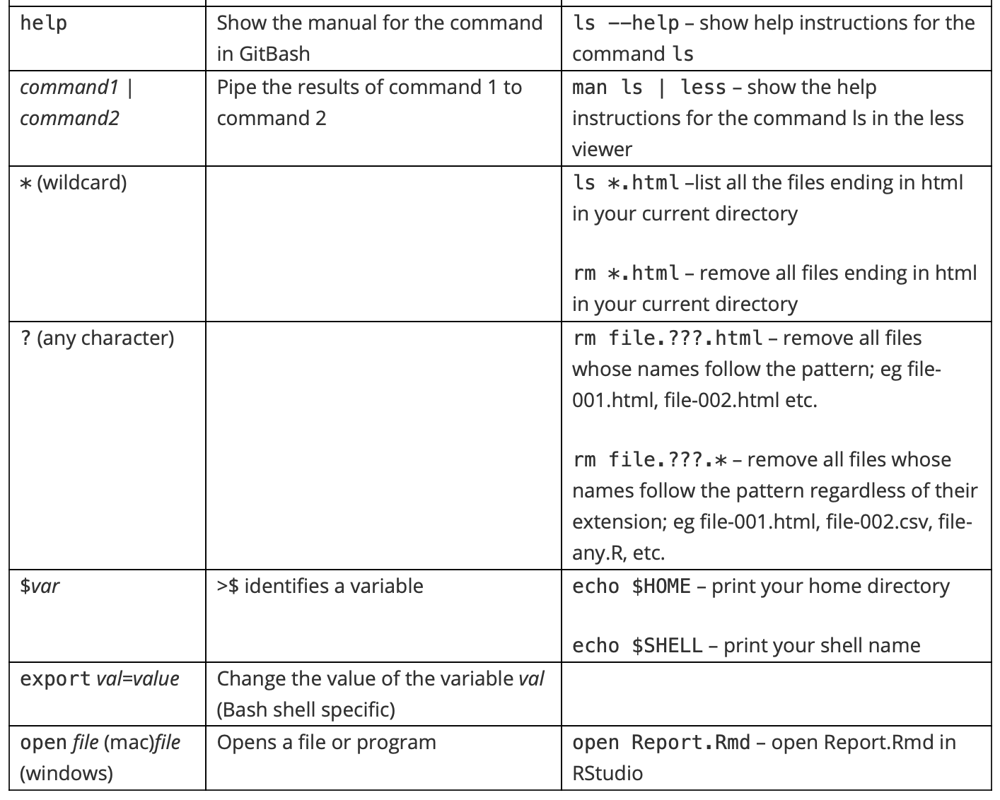

```{r setup, include=FALSE}
knitr::opts_chunk$set(echo = TRUE)
```

The textbook for the Data Science course series is [freely available online](https://rafalab.github.io/dsbook/).

## Learning Objectives

* How to leverage the many useful features provided by RStudio
* How to use Unix/Linux to manage your file system
* How to start a repository on GitHub
* How to perform version control with git

## Course Overview

### Section 1: Installing Software
You will learn how to install R, RStudio, git (and git bash for Windows users), create a GitHub account, create a GitHub repository, and connect RStudio to your GitHub account.

### Section 2: Unix
You will learn the basics of managing your filesystem from the terminal with Unix commands such as mv and rm.

### Section 3: Reproducible Reports
You will learn to create data science reports using R Markdown and the knitr package.

### Section 4: Git and GitHub
You will learn to use git and GitHub from the command line to clone and create repositories.

### Section 5: Advanced Unix
You will learn other Unix commands, including arguments, getting help, pipes, and wildcards that are helpful in data science.

## Introduction to Productivity Tools

The textbook for this section is available [here](https://rafalab.github.io/dsbook/introduction-to-productivity-tools.html)

**General Guiding Principles:**

* Be systematic when organizing your filesystem
* Automize when possible
* Minimize the use of the mouse

**What we will learn:**

* Unix shell
* Git and GitHub
* R markdown

## Section 1 Overview

The Installing Software section walks you through the steps to download and install R, RStudio, git (and git bash on Windows machines), create a GitHub account, and connect RStudio to GitHub.

There is a graded comprehension check at the end of the section.

If you get stuck, we encourage you to search the discussion boards for the answer to your issue or ask us for help!

## Installing Software

The textbook for this section is available [here](https://rafalab.github.io/dsbook/introduction-to-productivity-tools.html)

**Key points**

We will install:

* R: the programming language we use to analyze data
* RStudio: the integrated desktop environment we use to edit, organize, and test R scripts
* Git (and Git Bash for Windows): version control system

## Running Commands While Editing Scripts

**Key points**

* RStudio has many useful features as an R editor, including the ability to test code easily as we write scripts and several autocomplete features.

* Keyboard shortcuts:
    * Save a script: Ctrl+S on Windows and Command+S on Mac
    * Run an entire script:  Ctrl+Shift+Enter on Windows Command+Shift+Return on Mac, or click "Source" on the editor pane
    * Run a single line of script: Ctrl+Enter on Windows and Command+Return on Mac while the cursor is pointing to that line, or select the chunk and click "run"
    * Open a new script: Ctrl+Shift+N on Windows and Command+Shift+N on Mac

*Code*

```{r}
if(!require(tidyverse)) install.packages("tidyverse")

library(tidyverse)
```

## Keeping Organized with RStudio Projects

The textbook for this section is available [here](https://rafalab.github.io/dsbook/reproducible-projects-with-rstudio-and-r-markdown.html#rstudio-projects)

**Key points**

* RStudio provides a way to keep all the components of a data analysis project organized into one folder and to keep track of information about this project.
* To start a project, click on File > New Project > New repository > New project > decide the location of files and give a name to the project, e.g. "my-first-project". This will then generate a Rproj file called my-first-project.Rproj in the folder associated with the project, from which you can double click to start where you last left off.
* The project name will appear in the upper left corner or the upper right corner, depending on your operating system. When you start an RStudio session with no project, it will display "Project: (None)".

## Installing Git Introduction

**Key points**

* Git is a version control system, tracking changes and coordinating the editing of code.
* GitHub is a hosting system for code, which can help with your career profile.
* Git is most effectively used with Unix, but it can also interface with RStudio.

## Installing Git

* If you have a **Windows machine**, you will need to install **Git and Git Bash**.
* If you have a **Mac**, you will only need to install Git (which may already be installed on your system).

The textbook for this section is available [here (for Windows)](https://rafalab.github.io/dsbook/accessing-the-terminal-and-installing-git.html#installing-git-and-git-bash-on-windows) or [here (for Mac)](https://rafalab.github.io/dsbook/accessing-the-terminal-and-installing-git.html#installing-git-on-the-mac)

**Install on Windows**

1. Download Git bash from [here](https://git-scm.com/)
2. When asked to choose the default editor for Git, we recommend choosing nano if you do not already know VIM.
3. The "git and optional Unix tools from Windows" option will allow you to learn Unix from Rstudio, however, it might interfere with the Windows command line.
4. Finally, change the Rstudio preference so that you are using Git bash as the terminal (only for Windows user).

**Install on Mac**

1. Open the terminal, either from the utility folder or using Cmd+space, and check if you already have Git installed by typing ```git --version``` in the command line.
2. If you already have Git installed, you will be shown the version number after executing the above. If you do not have Git installed already, you will be prompted to do so.

## GitHub

The textbook for this section is available [here](https://rafalab.github.io/dsbook/git.html#github-accounts)

**Key points**

* Sign up for a GitHub account, with a name that is professional, short, and easy to remember
* Connect to RStudio: global options > Git/SVM, enter the path to git executables
* To avoid typing our GitHub password every time, we create a SSH/RSA key automatically through RStudio with the *create RSA key* button.

## GitHub Repositories

The textbook for this section is available [here](https://rafalab.github.io/dsbook/git.html#github-repos)

**Key points**

To create a new GitHub repository and link it to an RStudio project, follow 2 steps:

Step 1: Initialize a new repo on GitHub by clicking repository > new > choose a descriptive name.

Step 2: Connect to RStudio.

## RStudio, Git, and GitHub

The textbook for this section is available [here](https://rafalab.github.io/dsbook/git.html#git-overview)

**Key points**

* In terminal: configure git 

git config --global user.name "Your Name"
git config --global user.email "your@email.com"

* In RStudio, create project > Version control > Git
* Git pane: status symbols and color
* Git actions:
	1. **pull**: pull changes from remote repo (if you are in collaboration with others)
	2. **add**: stage files for commit; click on stage box under git pane
	3. **commit**: commit to the local repo; click on "commit" button under git pane; add a commit message
	4. **push**: push to the remote repo on Github
* .gitignore file: details check [here](https://git-scm.com/docs/gitignore)

## Comprehension Check - Installing Software

1. Which of the following statements about R and RStudio is true?

- [X] A. R is a programming language, whereas RStudio is a desktop environment.
- [ ] B. You can use RStudio without using R, but we recommend using R in this course.
- [ ] C. When you download RStudio, it automatically downloads and installs R too.
- [ ] D. You can only use R on Mac OS X and Linux. Windows users must use RStudio.

2. Select the code that will NOT install the popular graphing and data manipulation packages ```ggplot2``` and ```dplyr``` in R.

- [ ] A. ```install.packages(c(“ggplot2”,“dplyr”))```
- [ ] B. ```install.packages(“tidyverse”)```
- [X] C. ```install.packages(c("dplyr","ggplot2”)```
- [ ] D. ```install.packages(“ggplot2”) install.packages(“dplyr”)```

3. Which of the following is not true about installing packages? Select ALL that apply.

- [X] A. To install a new package, the install.packages() function can be used
- [ ] B. To install a new package, the drop-down menu Tools > Install packages can be used
- [ ] C. Installed packages will remain installed even if you upgrade R
- [X] D. Installing a package by building from GitHub will give you the exact same version as on CRAN

4. Which of the following commands for editing scripts is not correct?

- [ ] A. To save a script: Ctrl+S on Windows/Linux / Command+S on Mac
- [ ] B. To run an entire script: Ctrl+Shift+Enter on Windows/Linux / Command+Shift+Return on Mac, or click “Source” on the editor pane.
- [ ] C. To open a new script: Ctrl+Shift+N on Windows/Linux / Command+Shift+N on Mac
- [X] D. To run a single line of script: Ctrl+Shift / Command+Shift while cursor pointing to that line, or select the chunk and click "run"
- [ ] E. To comment selected text: Ctrl+Shift+C or Command+Shift+C for Mac.

5. Which of the following statements about keeping organized with RStudio projects is not correct?

- [ ] A. To start a new project, click on File > New Project > New directory > New project > {choose a file directory and project name}
- [X] B. You must always start a project in a new directory.
- [ ] C. RStudio provides a way to keep all components of a data analysis project organized into one folder and to keep track of information about this project.
- [ ] D. Creating a new R project will produce an .Rproj file associated with the project.

6. What can you change in the global options? Select ALL that apply.

- [ ] A. Set Git / GitHub configuration for each R project
- [X] B. Move the editor pane to the upper right
- [X] C. Change the editor theme to a dark background
- [X] D. Customize key binding

7. What does the term “pull” mean in the context of using Git in RStudio?

- [ ] A. Add local files to a remote GitHub repo.
- [X] B. Download changes from the remote repo to your local repository.
- [ ] C. Configure the RStudio environment to automatically connect to GitHub.
- [ ] D. Save changes made in RStudio to the local repository on your computer.

8. What does the term “push” mean in the context of using Git in RStudio?

- [X] A. Upload changes made in your local repository to a remote repository.
- [ ] B. Download changes from the remote repo to the RStudio environment.
- [ ] C. Configure the RStudio environment to automatically connect to GitHub.
- [ ] D. Save changes made in RStudio to the local repository on your computer.

9. What does the term “commit” mean in the context of using Git in RStudio?

- [ ] A. Add local files to a remote GitHub repo.
- [ ] B. Download changes from the remote repo to the RStudio environment.
- [ ] C. Configure the RStudio environment to automatically connect to GitHub.
- [X] D. Save changes made in RStudio to the local repository on your computer.

10. Did you create a GitHub account? Enter your GitHub username below.

1965Eric

## Section 2 Overview

The Unix section discusses the basics of managing your filesystem from the terminal with Unix commands such as ```mv``` and ```rm```. 

There is a two-part graded comprehension check at the end of the section.

\newpage

Below, you will find a summary of Unix commands that will be covered in this section and the Advanced Unix section. The examples here refer to this hypothetical file system


\newpage





\newpage

### Absolute path vs. relative path

A full path specifies the location of a file from the root directory. It is independent of your present directory, and must begin with either a “/” or a “~”. In this example, the full path to our “project-1” file is: 

/home/projects/project-1

A relative path is the path relative to your present working directory. If our present working directory is the “projects” folder, then the relative path to our “project-1” file is simply: 

project-1

### Path shortcuts

One period “.” is your current working directory

Two periods “..” is the parent directory (up one from your present working directory) 

A tilde   “~” is your home directory.

### More path examples

1. Your current working directory is ~/projects and you want to move to the figs directory in the project-1 folder

	- Solution 2: ```cd ~/projects/project-1/figs``` (absolute)
	- Solution 2: ```cd project-1/figs``` (relative)

2. Your current working directory is ~/projects and you want to move to the reports folder in the docs directory

	- Solution 1: ```cd ~/dos/reports``` (absolute)
	- Solution 2: ```cd ../docs/reports``` (relative)
	
3. Your current working directory is ~/projects/project-1/figs and you want to move to the project-2 folder in the projects directory.

	- Solution 1: ```cd ~/projects/project-2``` (absolute)
	- Solution 2: ```cd ../../project-2``` (relative)
	
## Organizing with Unix

The textbook for this section is available [here](https://rafalab.github.io/dsbook/unix.html)

**Resources**

You can learn more about Unix from a number of other resources:

[Codecademy](https://www.codecademy.com/learn/learn-the-command-line)

[Quora list of Linux reference books](https://www.quora.com/Which-are-the-best-Unix-Linux-reference-books)

## The Terminal

The textbook for this section is available [here](https://rafalab.github.io/dsbook/unix.html#the-terminal)

**Key points**

* The terminal helps to organize files in the system.
* On Mac, use utilities > terminal.
* On Windows, use Git bash program.
* Use the keyboard to navigate the command line.

*Code:* 

```{r, eval=FALSE, echo=TRUE}
echo "hello world"
```

## The Filesystem

The textbook for this section is available [here](https://rafalab.github.io/dsbook/unix.html#filesystem)

**Key points**

* We refer to all the files, folders, and programs (executables) on your computer as the **filesystem**.
* Your filesystem is organized as a series of nested folders each containing files, folders, and executables. (see the visualization above)
* In Unix, folders are referred to as directories and directories that are inside other directories are often referred to as subdirectories. 
* The home directory is where all your stuff is kept.  There is a hierarchical nature to the file system.
* **Note for Windows Users:** The typical R installation will make your *Documents* directory your home directory in R. This will likely be different from your home directory in Git Bash. Generally, when we discuss home directories, we refer to the Unix home directory which for Windows, in this book, is the Git Bash Unix directory.

## Working Directory

The textbook for this section is available [here](https://rafalab.github.io/dsbook/unix.html#working-directory)

**Key points**

* The working directory is the current location.
* Each terminal window has a working directory associated with it.
* The "pwd" command will display your working directory. The "/" symbol separates directories, while the first "/" at the beginning of the path stands for the root directory. When a path starts with "/", it is a "full path", which finds the current directory from the root directory. "Relative path" will be introduced soon.
* "~" means the home directory.

## Unix Commands

The textbook for this section is available [here](https://rafalab.github.io/dsbook/unix.html#unix-commands)

**Key points**

* navigate the file system with commands introduced in this section.
* Auto-complete paths, commands and file names with the "Tab" key.

*Code*

```{r, eval=FALSE, echo=TRUE}
ls #list dir content
mkdir folder_name #create directory called "folder_name"
rmdir folder_name  #remove an empty directory as long as it is empty
rm -r folder_name  #remove dir that is not empty, "r" stands for recursive
cd: change dir
../ # two dots represents parent dir
. # single dot represents current workingdir 
cd ~/projects # concatenate with forward slashes
cd ../.. # change to two parent layer beyond
cd -  # whatever dir you were before
cd  # return to the home dir
```

## mv and rm: Moving and Removing Files

The textbook for this section is available [here](https://rafalab.github.io/dsbook/unix.html#more-unix-commands)

**Key points**

* The mv command moves files.
* **[warning]** mv will not ask you to confirm the move, and it could potentially overwrite a file.
* The rm command removes files.
* **[warning]** rm is permanent, which is different than throwing a folder in the trash.

*Code*

```{r, eval=FALSE, echo=TRUE}
mv path-to-file path-to-destination-directory
rm filename-1 filename-2 filename-3
```

## less: Looking at a File

The textbook for this section is available [here](https://rafalab.github.io/dsbook/unix.html#less-looking-at-a-file)

**Key points**

* ```less``` allows you to quickly look at the content of a file
* Use q to exit the ```less``` page
* use the arrows to navigate in the ```less``` page

*Code

```{r, eval=FALSE, echo=TRUE}
less cv.tex
```

## Preparing for a Data Science Project

The textbook for this section is available [here](https://rafalab.github.io/dsbook/unix.html#prep-project)

**Key points**

* Ideally, files (code, data, output) should be structured and self-contained
* In a project, we prefer using relative paths (path relative to the default working directory) instead of the full path so that code can run smoothly on other individual's computers.
* It is good practice to write a README.txt file to introduce the file structure to facilitate collaboration and for your future reference.

*Code*

```{r, eval=FALSE, echo=TRUE}
########### In terminal ###########
cd ~    # move to home directory
mkdir projects    # make a new directory called projects
cd projects    # move to ~/projects directory
mkdir murders    # make new directory called murders inside of projects
cd murders    # move to ~/projects/murders/
mkdir data rda    # make two new directories, one is data the other is rda folder
ls    # to check if we indeed have one data folder and one rda folder
pwd    # check the current working directory
mkdir figs    # make a directory called figs to store figures

########## In RStudio ########
# pick existing directory as new project
getwd()    # to confirm current working directory
save()    # save into .rda file, .RData is also fine but less preferred
ggsave("figs/barplot.png")    # save a plot generated by ggplot2 to a dir called "figs"
```

## Comprehension Check Part 1 - Basic Unix

1. It is important to know which directory, or folder, you’re in when you are working from the command line in Unix. Which line of code will tell you the current working directory?

- [ ] A. ```cd```
- [X] B. ```pwd```
- [ ] C. ```rm```
- [ ] D. ```echo```

2. You can’t use your computer’s mouse in a terminal. How can you see a line of code that you executed previously?

- [ ] A. Type ```pwd```
- [ ] B. Type ```echo```
- [X] C. Use the up arrow
- [ ] D. Press the enter key

3. Assume a student types ```pwd``` and gets the following output printed to the screen: ```/Users/student/Documents```.

Then, the student enters the following commands in sequence:

```{r, eval=FALSE, echo=TRUE}
mkdir projects
cd projects
```

What will be printed to the screen if the student types pwd after executing the two lines of code shown above?

- [ ] A. ```/Users/student/Documents```
- [X] B. ```/Users/student/Documents/projects```
- [ ] C. ```/Users/student```
- [ ] D. ```cd: projects: No such file or directory```

4. Which of the following statements does NOT correctly describe the utility of a command in Unix?

- [ ] A. The $q$ key exits the viewer when you use ```less``` to view a file.
- [ ] B. The command ```ls``` lists files in the current directory.
- [X] C. The command ```mkdir``` makes a new directory and moves into it.
- [ ] D. The ```mv``` command can move a file and change the name of a file.

5. The following is the full path to a your homework assignment file called “assignment.txt”: 

```{r, eval=FALSE, echo=TRUE}
/Users/student/Documents/projects/homeworks/assignment.txt
```

Which line of code will allow you to move the assignment.txt file from the "homeworks" directory into the parent directory "projects"?

- [ ] A. ```mv assignment.txt```
- [ ] B. ```mv assignment.txt .```
- [X] C. ```mv assignment.txt ..```
- [ ] D. ```mv assignment.txt /projects```

6. You want to move a file called ```assignment.txt``` file into your ```projects``` directory. However, there is already a file called “assignment.txt” in the ```projects``` directory.

What happens when you execute the “move” (```mv```) command to move the file into the new directory?

- [X] A. The moved "assignment.txt" file replaces the old "assignment.txt" file that was in the "projects" directory with no warning.
- [ ] B. An error message warns you that you are about to overwrite an existing file and asks if you want to proceed.
- [ ] C. An error message tells you that a file already exists with that name and asks you to rename the new file.
- [ ] D. The moved “assignment.txt” file is automatically renamed “assignment.txt (copy)” after it is moved into the “projects” directory.

## Comprehension Check Part 2

7. What does each of ```~```, ```.```, ```..```, ```/``` represent, respectively?

- [ ] A. Current directory, Home directory, Root directory, Parent directory
- [X] B. Home directory, Current directory, Parent directory, Root directory
- [ ] C. Home directory, Hidden directory, Parent directory, Root directory
- [ ] D. Root directory, Current directory, Parent directory, Home directory
- [ ] E. Home directory, Parent directory, Home directory, Root directory

8. Suppose you want to delete your project directory at ./myproject. The directory is not empty - there are still files inside of it.

Which command should you use?
- [ ] A. rmdir myproject
- [ ] B. rmdir ./myproject
- [X] C. rm -r myproject
- [ ] D. rm ./myproject

9. The source() function reads a script from a url or file and evaluates it. Check ?source in the R console for more information.

Suppose you have an R script at ```~/myproject/R/plotfig.R``` and getwd() shows ```~/myproject/result```, and you are running your R script with ```source('~/myproject/R/plotfig.R')```.

Which R function should you write in plotfig.R in order to correctly produce a plot in ```~/myproject/result/fig/barplot.png```?
- [X] A. ggsave('fig/barplot.png'), because this is the relative path to the current working directory.
- [ ] B. ggsave('../result/fig/barplot.png'), because this is the relative path to the source file ("plotfig.R").
- [ ] C. ggsave('result/fig/barplot.png'), because this is the relative path to the project directory.
- [ ] D. ggsave('barplot.png'), because this is the file name.

10. Which of the following statements about the terminal are not correct? Select ALL that apply.

- [ ] A. echo is similar to cat and can be used to print.
- [ ] B. The up arrow can be used to go back to a command you just typed.
- [X] C. You can click on the terminal to change the position of the cursor
- [X] D. For a long command that spans three lines, we can use the up-arrow to navigate the cursor to the first line.

11. Which of the following statements about the filesystem is not correct?

- [X] A. The home directory is where the system files that come with your computer exist.
- [ ] B. The name of the home directory is likely the same as the username on the system.
- [ ] C. File systems on Windows and Mac are different in some ways.
- [ ] D. Root directory is the directory that contains all directories.

12. Which of the following meanings for options following less are not correct? (Hint: use man less to check.)

- [ ] A. -g: Highlights current match of any searched string
- [ ] B. -i: case-insensitive searches
- [X] C. -S: automatically save the search object
- [ ] D. -X: leave file contents on screen when less exits.

13. Which of the following statements is incorrect about preparation for a data science project? Select ALL that apply.

- [X] A. Always use absolute paths when working on a data science project.
- [X] B. Saving .RData every time you exit R will keep your collaborator informed of what you did.
- [ ] C. Use ggsave to save generated files for use in a presentation or a report.
- [X] D. Saving your code in a Word file and inserting output images is a good idea for making a reproducible report.

## Reproducible Reports

1. Why R Markdown?

Why might you want to create a report using R Markdown?
- [ ] A. R Markdown has better spell-checking tools than other word processors.
- [X] B. R Markdown allows you to automatically add figures to the final document.
- [ ] C. R Markdown final reports have smaller file sizes than Word documents.
- [ ] D. R Markdown documents look identical to the final report.

2. Naming an R Chunk

You have a vector of student heights called heights. You want to generate a histogram of these heights in a final report, but you don’t want the code to show up in the final report. You want to name the R chunk “histogram” so that you can easily find the chunk later.

Which of the following R chunks does everything you want it to do?
- [ ] A. /{r, histogram, echo=FALSE} hist(heights)
- [ ] B. {r histogram} hist(heights)
- [ ] C. {r, echo=FALSE} hist(heights)
- [X] D. {r histogram, echo=FALSE} hist(heights)

3. R Markdown Report

Below is a section of R Markdown code that generates a report.

$\text{---}$
$\text{title: "Final Grade Distribution"}$
$\text{output: pdf_document}$
$\text{---}$
$\text{```{r, echo=FALSE}}$
$\text{load(file="my_data.Rmd")}$
$\text{summary(grades)}$
$\text{```}$

4. 

$\text{```{r, echo=F}}$
$\text{n <- nrow(mtcars)}$
$\text{```}$

- [X] A. The only output is the text: Here 32 cars are compared.
- [ ] B. Since we have echo=F, the code chunk is not evaluated, therefore we will have both the code and the text: Here `r n` cars are compared.
- [ ] C. The code will be displayed as well as Here 32 cars are compared.
- [ ] D. R cannot comprehend the value of n, we will get an error.

6. What is the final value from these three sequential Rmd code chunks?

$\text{{r, eval=FALSE}}$
$\text{a <- 2}$
$\text{```}$

$\text{```{r, include=FALSE}}$
$\text{print("Hello World!")}$
$\text{a <- 5}$
$\text{```}$

$\text{```{r, echo=FALSE}}$
$\text{a <- a+1}$
$\text{print(a)}$
$\text{```}$

- [ ] A. 2
- [ ] B. 3
- [X] C. 6
- [ ] D. 5

## Git and GitHub


1. Git and GitHub Benefits

Which statement describes reasons why we recommend using git and Github when working on data analysis projects?
- [ ] A. Git and Github facilitate fast, high-throughput analysis of large data sets.
- [X] B. Git and Github allow easy version control, collaboration, and resource sharing.
- [ ] C. Git and Github have graphical interfaces that make it easy to learn to code in R.
- [ ] D. Git and Github is good for long-term storage of private data.

2. Using Git at the Command Line

Select the steps necessary to:
1. create a directory called “project-clone”,
2. clone the contents of a git repo at the following URL into that directory (https://github.com/user123/repo123.git), and
3. list the contents of the cloned repo.
- [ ] A.
```
mkdir project-clone
git add https://github.com/user123/repo123.git
ls
```
- [ ] B.
```
mkdir project-clone
git clone https://github.com/user123/repo123.git
ls
```
- [X] C.
```
mkdir project-clone
cd project-clone
git clone https://github.com/user123/repo123.git
ls
```
- [ ] D.
```
mkdir project-clone
cd project-clone
git clone https://github.com/user123/repo123.git
less
```
3. Git Status

You have successfully cloned a Github repository onto your local system. The cloned repository contains a file called “heights.txt” that lists the heights of students in a class. One student was missing from the dataset, so you add that student’s height using the following command:
```
echo “165” >> heights.txt
```
Next you enter the command git status to check the status of the Github repository.

What message is returned and what does it mean?
- [X] A. modified: heights.txt, no changes added to commit This message means that the heights.txt file was modified, but the changes have not been staged or committed to the local repository.
- [ ] B. modified: heights.txt, no changes added to commit This message means that the heights.txt file was modified and staged, but not yet committed.
- [ ] C. 1 file changed This message means that the heights.txt file was modified, staged, committed, and pushed to the upstream repository.
- [ ] D. modified: heights.txt This message means that the heights.txt file was modified, staged, and committed.

4. Modifying a File in an Upstream Repo

You cloned your own repository and modified a file within it on your local system. Next, you executed the following series of commands to include the modified file in the upstream repository, but it didn’t work. Here is the code you typed:
```
git add modified_file.txt
git commit -m “minor changes to file” modified_file.txt
git pull
```
What is preventing the modified file from being added to the upstream repository?
- [ ] A. The wrong option is being used to add a descriptive message to the commit.
- [X] B. git push should be used instead of git pull.
- [ ] C. git commit should come before git add.
- [ ] D. The git pull command line needs to include the file name.

5. Creating a GitHub Repository Readme File

You have a directory of scripts and data files on your computer that you want to share with collaborators using GitHub. You create a new repository on your GitHub account called “repo123” that has the following URL: 
```
https://github.com/user123/repo123.git
```
Which of the following sequences of commands will convert the directory on your computer to a Github directory and create and add a descriptive “read me” file to the new repository?
- [ ] A.
```
git init
git add README.txt
git commit -m "First commit. Adding README file."
git remote add origin `https://github.com/user123/repo123.git`
git push
```
- [ ] B.

```
echo “A new repository with my scripts and data” > README.txt
git init
git add
git commit -m "First commit. Adding README file."
git remote add origin `https://github.com/user123/repo123.git`
git push
```
- [ ] C.

```
echo “A new repository with my scripts and data” > README.txt
git init
git add README.txt
git commit -m "First commit. Adding README file."
git remote add origin `https://github.com/user123/repo123.git`
git pull
```
- [X] D.

```
echo “A new repository with my scripts and data” > README.txt
git init
git add README.txt
git commit -m "First commit. Adding README file."
git remote add origin `https://github.com/user123/repo123.git`
git push
```

6. You have made a local change to a file in your R project, which is associated with a GitHub repository. You add your changes and push, but you receive a message:

```Everything up-to-date```
Which of the following commands did you forget to do?
- [ ] A. git pull
- [ ] B. git merge
- [ ] C. git add
- [ ] D. git fetch
- [X] E. git commit
- [ ] F. git push
- [ ] G. git rebase

7. Suppose you previously cloned a repository with git clone. Running git status shows:
```
On branch master
Your branch is up to date with 'origin/master'.

	nothing to commit, working tree clean
```

However, you know that there are some changes in the upstream repository.

How will you sync these changes with one command?
- [ ] A. git fetch
- [X] B. git pull
- [ ] C. git merge origin/master
- [ ] D. git merge upstream/master
- [ ] E. git push

## Advanced Unix Arguments

1. Arguments

What will the command ls -lat produce?
- [X] A. A list of all file (names, sizes, and other information) arranged in chronological order with the most recently modified files at the top of the list.
- [ ] B. A list of visible files (names, sizes, and other information) arranged in chronological order with the oldest files at the top of the list.
- [ ] C. A list of all files (names only) arranged in chronological order with the oldest files at the top of the list.
- [ ] D. A list of visible files (names only) arranged in chronological order with the most recent files at the top of the list.

Note: The -l argument makes the list “long”, meaning that information other than just the filename will be provided. The -a argument says that you want to see “all” files, even the hidden ones. The -t argument sorts the list by time, with the most recent files at the top.

2. What happens when you remove a directory using the command rm -r?

- [ ] A. You cannot remove a directory using the rm command.
- [X] B. You permanently remove the entire directory, including all files and subdirectories.
- [ ] C. You move the entire directory to a trash folder, but it can be restored later.
- [ ] D. You get a warning message asking if you want to proceed, then you delete the directory.

Note: Use remove commands with caution in Unix. You can permanently delete entire directories with no warning.

3. Advanced Unix Getting Help and Pipes

By default, the head command in Unix displays the first 10 lines of a specified file. You can change the number of lines using an argument that indicates the numeric value of the desired number of lines.

Which of the following commands displays only the first 6 lines of a manual for the ls command?
- [ ] A. man ls -6 | head
- [ ] B. head | man ls -6
- [ ] C. head -6 | man ls
- [X] D. man ls | head -6

4. Advanced Unix Wildcards

You have a directory containing the following files.

data1.csv, data2.txt, data3.txt, Data8.csv, data13.csv, data18.txt, Data22.txt, Data34.csv

Which command will list only all of the .txt files that have “data” in their name? Remember that commands are case-sensitive.
- [ ] A. ls data*
- [X] B. ls data*.txt
- [ ] C. ls *.txt
- [ ] D. ls data?.txt

5. You have a directory containing the following files.

data1.csv, data2.txt, data3.txt, Data8.csv, data13.csv, data18.txt, Data22.txt, Data34.csv

Which command will remove every file that begins with “D”?
- [X] A. rm D*
- [ ] B. rm D*.txt
- [ ] C. ls D*
- [ ] D. ls D*.txt

6. Imagine you have multiple text files in the following directory: /Users/student/Documents/project.

You enter the following commands in sequence:
```
mkdir data
mv *.txt data
cd data
```
What will be printed to the screen if you enter the ls command after executing the three lines of code shown above?
- [ ] A. /Users/student/Documents/project/data
- [X] B. The file names that were moved from the “project” directory into the “data” directory.
- [ ] C. Nothing. You haven’t added anything to the new “data” directory yet.
- [ ] D. The file names that remain in the “project” directory.

7. Advanced Unix Environment Variables and Shells

What does the command echo $HOME do?
- [ ] A. Moves into to the home directory. 
- [ ] B. Makes the current directory the home directory. 
- [X] C. Prints the path to the home directory. 
- [ ] D. Prints “$HOME” to the screen.

8. Many systems operate using the Unix shell and command language, bash. Each time you start using bash, it executes the commands contained in a “dot” file. Your “dot” file may be called something like “.bash_profile” or “.bash_rc”.

Which command will let you see your “dot” files?
- [X] A. ls -a
- [ ] B. ls bash*
- [ ] C. head *bash*
- [ ] D. ls -l

9. Your colleague was editing his “dot” files when something went wrong. He first noticed there was an issue when he tried to execute the following line of code:
```
ls
```
He received the following error:
```
-bash: ls: command not found
```
What could have happened to cause this error?
- [ ] A. He is trying to execute ls which is a bash command, but his system isn’t running bash as a shell.
- [ ] B. The command ls doesn’t exist. He should be using the command ll.
- [ ] C. He forgot to specify a file name to be listed. The command ls * should work.
- [X] D. He changed the information contained in $PATH. Now the system cannot find the executable file for ls.

10. The bash profile in your home directory contains information that the bash shell runs each time you use it. You can customize the information in your bash profile to tell your system to do different things. For example, you can make an “alias”, which acts like a keyboard shortcut.

Which line of code, when added to your bash profile, will let you print “seetop” to view the name, size, and file type of the 10 most recently added visible files?
- [ ] A. alias seetop=’ls -lt’
- [X] B. alias seetop=’ls -lt | head’
- [ ] C. alias seetop=’ls -t | head’
- [ ] D. alias seetop=’head | ls -l’

11. The commands in the pipeline $ cat result.txt | grep "Harvard edX" | tee file2.txt | wc -l perform which of the following actions?

- [ ] A. From result.txt, select lines containing “Harvard edX”, store them into file2.txt, and print all unique lines from result.txt.
- [ ] B. From result.txt, select lines containing “Harvard edX”, and store them into file2.txt.
- [X] C. From result.txt, select lines containing “Harvard edX”, store them into file2.txt, and print the total number of lines which were written to file2.txt.
- [ ] D. From result.txt, select lines containing “Harvard edX”, store them into file2.txt, and print the number of times “Harvard edX” appears.

12. How is git rebase used?

- [ ] A. To switch branches or restore working tree files
- [ ] B. Uses a binary search to find the commit that introduced a bug
- [X] C. To reapply commits on top of another base tip
- [ ] D. To reset the current HEAD to the specified state
- [ ] E. To download objects and refs from another repository

13. Which of the following statements is wrong about Advanced Unix Executables, Permissions, and File Types?

- [X] A. In Unix, all programs are files/executables except for commands like ls, mv, and git.
- [ ] B. which git allows a user to find the path to git.
- [ ] C. When users create executable files themselves, they cannot be run just by typing the command - the full path must be typed instead.
- [ ] D. ls -l can be used to inspect the permissions of each file.

14. Which of the following commands correctly copies all files which are named as file-???.r (e.g file-abc.r, file-qwe.r, file-123.r) into the directory named your_directory?

- [X] A. cp file-???.r ./your_directory
- [ ] B. cp file-*.r ./your directory
- [ ] C. cp file-[a-z].r ./your_directory
- [ ] D. cp file-???.* ./your_directory
